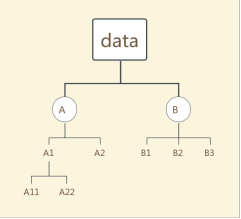

# learning based intrusion detection
multiple intrusion detection implementations using machine learning algorithms.

[TOC]

## online model

for intrusion detection system, online detecting is of importance to figure out possible attacks timely.

## offline model

However, offline models are the main topic discussed by a variety of papers. Currently, offline models can be divided into multi-level, 

### offline multi-level/hierarchical model

Currently, most multi-level models are actually multi-classification models. As we can see, most in-use classification algorithms are bi-classifications. There are multiple methods to extend them to multi-class algorithm, such as 1 vs all, 1 vs 1, tree. Generally speaking, those models are just trying to divide original multiple class into 2 groups and apply classfication algorithm recursively. So these methods will derive multiple levels in the multi-classification process. 

It's then freely to select classification algorithms at each level to achieve good performances. For example, use SVM at first level to distinguish A and B, then use ELM to separate A1 and A2, use multi-logistic to handle B1, B2, B3. Please notice, the combination of classification algorithms is totally free, we can even use  multi-classification model not only bi-classification model to process a particular level if with good performance. However, the choice of algorithm combinations is usually experiment inspired without a clear guide theory. 

It's clear that the so-called multi-level model is actually a hierarchical classification model, belonging the part of ensemble learning.

## Useful Stuffs

## preprocess

There are many types of preprocessing. We can preprocess data to have a high quality data subset to gain quicker speed and better accuarcy, or to make data subject to a certain distribution to meet the needs of algorithm, or to get rid of outlier, or to turn lexical features into numerical ones... Preprocess is important to led to a out-performanced model.

### Feature Selection

For IDS, there are many side knowledge to help us choose and design features.

### Dataset

+ KDD CUP 1999: very old. [http://kdd.ics.uci.edu/databases/kddcup99/kddcup99.html](https://www.researchgate.net/deref/http%3A%2F%2Fkdd.ics.uci.edu%2Fdatabases%2Fkddcup99%2Fkddcup99.html)

+ The University of New Mexico (UNM) dataset. [http://www.cs.unm.edu/~immsec/systemcalls.htm](https://www.researchgate.net/deref/http%3A%2F%2Fwww.cs.unm.edu%2F~immsec%2Fsystemcalls.htm)

+ [The ADFA Intrusion Detection Datasets](http://www.cybersecurity.unsw.adfa.edu.au/ADFA%20IDS%20Datasets/)

+ [Public PCAP files for download](http://www.netresec.com/?page=PcapFiles)

+ [Cyber Research Center - DataSets](http://www.westpoint.edu/crc/SitePages/DataSets.aspx)

+ [UNB](http://www.unb.ca/research/iscx/dataset/index.html)

+ [CSIC 2010 HTTP Dataset in CSV format (for Weka Analysis)](http://bit.ly/csic-2010-http-dataset-csv)

+ [Attack Challenge - ECML/PKDD Workshop](http://www2.lirmm.fr/pkdd2007-challenge/#dataset)

+ [The NSL-KDD Data Set](http://nsl.cs.unb.ca/NSL-KDD/)

+ [gureKddcup data base](http://www.sc.ehu.es/acwaldap/gureKddcup/gureKddcup_index.htm)

+ [Stratosphere IPS](https://stratosphereips.org/category/dataset.html)

+ [CAIDA : data : passive](https://www.caida.org/data/passive/ddos-20070804_dataset.xml)

+ [UCSD Network Telescope -- The Backscatter Dataset](https://www.caida.org/data/passive/backscatter_dataset.xml)

+ [DARPA Intrusion Detection Evaluation](http://www.ll.mit.edu/mission/communications/cyber/CSTcorpora/ideval/data/2000data.html)

+ [Information Security Center of eXcellence](http://iscx.ca/datasets)

+ [http://dx.doi.org/10.1109/WCNC.2013.6555301](https://www.researchgate.net/deref/http%3A%2F%2Fdx.doi.org%2F10.1109%2FWCNC.2013.6555301)

+ [http://www.cybersecurity.unsw.adfa.edu.au/ADFA%20IDS%20Datasets/](https://www.researchgate.net/deref/http%3A%2F%2Fwww.cybersecurity.unsw.adfa.edu.au%2FADFA%2520IDS%2520Datasets%2F)

+ [http://icsdweb.aegean.gr/awid/](https://www.researchgate.net/deref/http%3A%2F%2Ficsdweb.aegean.gr%2Fawid%2F)

+ [https://github.com/markusring/CIDDS](https://www.researchgate.net/deref/https%3A%2F%2Fgithub.com%2Fmarkusring%2FCIDDS), [https://www.hs-coburg.de/cidds](https://www.researchgate.net/deref/https%3A%2F%2Fwww.hs-coburg.de%2Fcidds)

+ [Stratosphere IPS Dataset](https://stratosphereips.org/category/dataset.html)

+ [The ADFA Intrusion Detection Datasets (2013) - for HIDS](http://www.cybersecurity.unsw.adfa.edu.au/ADFA%20IDS%20Datasets/)

+ [ITOC CDX (2009)](http://www.westpoint.edu/crc/SitePages/DataSets.aspx)

+ <http://www.kdnuggets.com/2017/01/machine-learning-cyber-security.html>

+ http://www.secrepo.com/

  ​